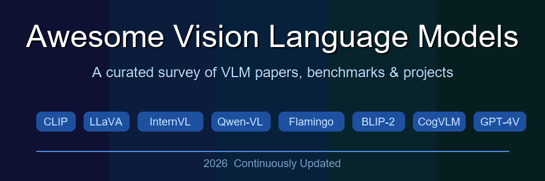
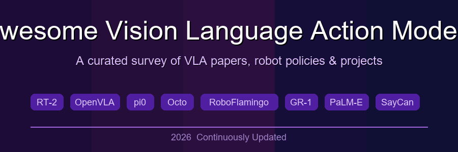

<div align="center">

 

# Awesome Multimodal Intelligence

[](https://github.com/sindresorhus/awesome)
[](https://opensource.org/licenses/MIT)


**中文** | [English](#english)

专注于 VLM、VLA、世界模型及通用具身智能等方向，收录前沿论文、开源代码与数据集，追踪从感知到决策的下一代智能体技术。

A curated collection for multimodal intelligence research, covering VLMs, VLAs, World Models, and embodied AI — tracking next-generation agent technologies from perception to decision-making, with a focus on papers, code, and datasets.

如果本仓库对你有帮助，欢迎 Star ⭐ 或分享 ⬆️，感谢支持！

If you find this repository helpful, please consider Stars ⭐ or Sharing ⬆️. Thanks.

</div>

---

## 📌 News

- **2026.4**: 仓库初始化，整合 VLM 与 VLA 两大方向，持续更新中。
- **2026.4**: Initial release — integrating VLM and VLA collections, continuously updated.

---

## 📂 Collection Index

| 方向 / Topic　　　　　　　　　　　　　　　　| 描述 / Description　　　　　　　　　　　　　　　　　　　　　　　　　　　　　　　　　　　　　| 链接 / Link　　　　　　　　　　　　　　　　　　　　　　 |
| :-------------------------------------------:| :--------------------------------------------------------------------------------------------| :-------------------------------------------------------:|
| 🖼️ **Vision Language Models (VLMs)**　　　　| 视觉语言模型：感知、理解与多模态推理<br>Perception, understanding, and multimodal reasoning | [📄 View](./midfiles/Awesome-Vision-Language-Models.md) |
| 🤖 **Vision Language Action Models (VLAs)** | 视觉语言动作模型：从感知到物理决策<br>From perception to physical decision-making　　　　　 | [📄 View](./midfiles/Awesome-Vision-Language-Action-Models.md)　 |
| 🌍 **World Models** *(coming soon)*　　　　 | 世界模型：环境建模与预测性规划<br>Environment modeling and predictive planning　　　　　　　| 🔜　　　　　　　　　　　　　　　　　　　　　　　　　　　|
| 🧠 **Embodied AI** *(coming soon)*　　　　　| 通用具身智能：感知、规划与执行的统一<br>Unified perception, planning, and execution　　　　 | 🔜　　　　　　　　　　　　　　　　　　　　　　　　　　　|

---

## 🗺️ Research Landscape

```
Perception ──► Understanding ──► Reasoning ──► Planning ──► Action
    │               │                │              │           │
   VLMs            VLMs             VLMs           VLAs        VLAs
                                  World Models   World Models  Embodied AI
```

- **VLMs** 负责视觉感知与语言理解的桥接，是整个智能体栈的感知基础。
- **VLAs** 在 VLM 基础上引入动作输出，实现端到端的感知-决策闭环。
- **World Models** 对环境动态建模，为规划提供预测性先验。
- **Embodied AI** 整合上述能力，面向真实世界的通用智能体。

---

## 🔖 Quick Links

- [Awesome VLMs →](./Awesome-Vision-Language-Models.md)
  - Contrastive Pre-training (CLIP, ALIGN, Florence)
  - Generative VLMs (Flamingo, BLIP-2, LLaVA)
  - Instruction-Tuned VLMs (InternVL, Qwen2-VL, LLaVA-1.5)
  - Grounding & Localization (KOSMOS-2, Grounding DINO)
  - Benchmarks (MMMU, MMBench, SeedBench)
  - Applications: Medical, Document, Video, Embodied

- [Awesome VLAs →](./Awesome-Vision-Language-Action-Models.md)
  - Foundational Policies (ACT, Diffusion Policy, RT-1, SayCan)
  - VLA Base Models (RT-2, OpenVLA, π0)
  - Generalist Policies (Octo, CrossFormer)
  - Manipulation, Navigation, Dexterous Control
  - RL & Self-Improvement (OpenVLA-OFT, VLARL)
  - Datasets & Benchmarks (Open X-Embodiment, LIBERO, CALVIN)

---

## 🤝 Contributing

欢迎提交 PR 补充新论文、数据集或工具！请遵循各子文档的表格格式。

PRs are welcome to add new papers, datasets, or toolkits. Please follow the table format in each sub-document.

1. Fork 本仓库
2. 在对应的 `.md` 文件中添加条目
3. 提交 Pull Request，简要说明新增内容

---

## 📜 License

This project is released under the [MIT License](./LICENSE).

---

<div align="center">
<sub>Maintained with ❤️ — tracking the frontier of multimodal intelligence</sub>
</div>
